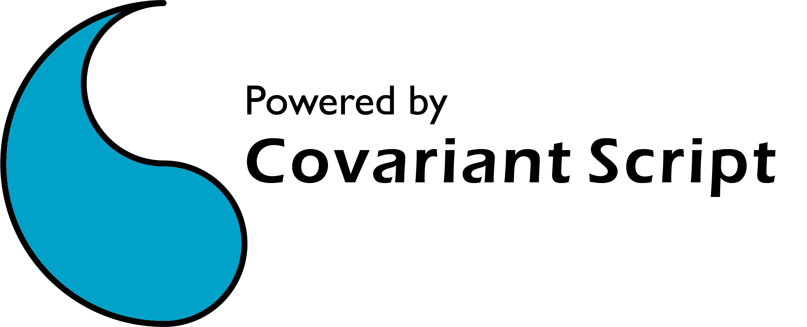

# CovScript CNI Standalone Edition


CovScript CNI SE is a API level compatible version separated from CovScript SDK
## How to use
### 1. Compatible to CovScript SDK
Just run `csbuild/make.sh` (in Linux and macOS) or `csbuild/make.bat` (in Windows), and set the absolute path of `csdev` to environment variable `CS_DEV_PATH`
### 2. Easy to Integration
Clone this repo to your root folder of source code and set it as your subdirectory in `CMakeLists.txt`:
```
add_subdirectory(cni)
include_directories(cni/include)
target_link_libraries(XXX covscript)
```
## Compatibility Note
**CovScript CNI SE** only compatible with extensions using the standard CNI APIs, not with extensions using APIs from CovScript SDK.